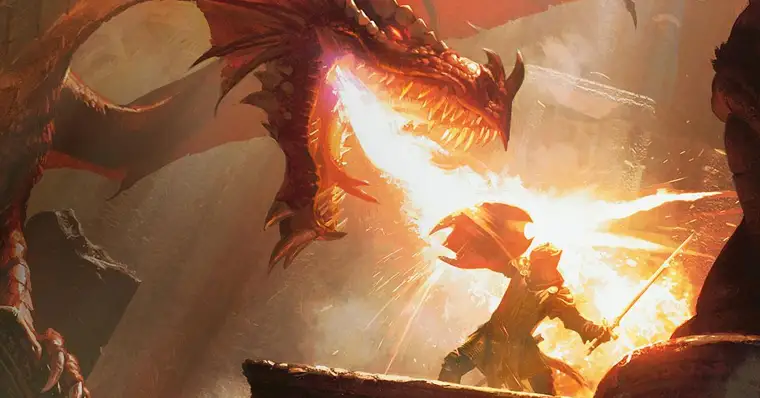

# Trybers & Dragons

### Projeto realizado durante o módulo de back-end na Trybe 💚

## Tecnologias utilizadas:

  
  
Node.js

  
  
MySQL

  
  
Typescript

---
## Arquitetura:
MSC: Model, Service e Controller.

---

## Sobre o desenvolvimento:
Para este projeto, foram revisados os princípios da arquitetura SOLID e os princípios de POO em uma estrutura de jogos de interpretação de papéis, mais conhecidos como jogos RPG (Role Playing Game).

No universo de Trybers and Dragons - T&D, quase todos os seres que andam por essas terras pertencem a uma raça definida.

As diversas raças (como, por exemplo, Élfica, Orc ou Anã) definem as características das personagens dentro do jogo desde a sua criação, como os seus pontos de vida e a sua destreza. No entanto, existem seres bestiais denominados monstros que não possuem uma raça específica, mas podem lutar.

Alguns seres também possuem uma energia e, ao treinarem o uso da energia, passam a possuir um arquétipo. De modo geral, os arquétipos definem a vocação de uma personagem, suas habilidades e visão de mundo: como encaram as situações, exploram masmorras ou enfrentam monstros. Como exemplos de arquétipos presentes em T&D, podemos citar guerreiro, mago e necromante.

Boa parte dos seres podem ser considerados lutadores, bastando para isso possuir alguns atributos específicos. Em muitas ocasiões podem acontecer lutas entre personagens diversas, bem como entre personagens e monstros.

----

### Requisitos

01 - Classe Race

02 - Classes que herdam de Race

03 - Energy

04 - Classe Archetype

05 - Classes que herdam de Archetype

06 - Interface Fighter

07 - Classe Character

08 - Interface SimpleFighter

09 - Classe Monster